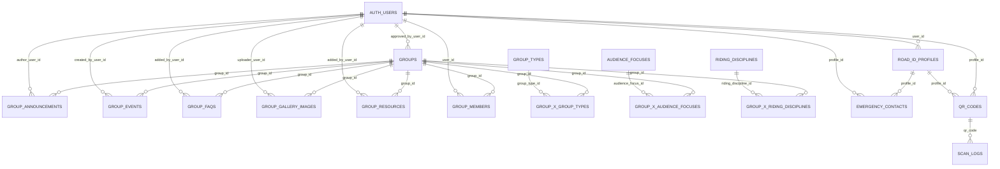

# Supabase Database — Public Schema Documentation

Generated: auto-generated via MCP inspection

## Overview

- Schema: `public`
- Row-Level Security (RLS): Disabled on all public tables (no policies defined)
- External references: Several foreign keys reference `auth.users`
- System table: `spatial_ref_sys` (from PostGIS)

## Entity-Relationship Diagram



## Tables

### audience_focuses

- Primary key: `id int4`
- Columns:
  - `id int4 not null default nextval('audience_focuses_id_seq')`
  - `name text not null unique`
  - `slug text not null unique`
  - `description text null`
- Referenced by:
  - `group_x_audience_focuses.audience_focus_id → audience_focuses.id`

### emergency_contacts

- Primary key: `id int8 identity by default`
- Columns:
  - `id int8 not null identity`
  - `profile_id uuid not null`
  - `contact_name text not null`
  - `contact_phone text not null`
  - `contact_relationship text null`
  - `created_at timestamptz null default now()`
- Foreign keys:
  - `profile_id → auth.users.id`
  - `profile_id → road_id_profiles.user_id`

### group_announcements

- Primary key: `id uuid`
- Columns:
  - `id uuid not null default uuid_generate_v4()`
  - `group_id uuid not null`
  - `author_user_id uuid not null`
  - `created_at timestamptz not null default timezone('utc', now())`
  - `updated_at timestamptz not null default timezone('utc', now())`
  - `title text not null`
  - `content text not null`
  - `is_pinned bool null default false`
- Foreign keys:
  - `group_id → groups.id`
  - `author_user_id → auth.users.id`

### group_events

- Primary key: `id uuid`
- Columns:
  - `id uuid not null default uuid_generate_v4()`
  - `group_id uuid not null`
  - `created_at timestamptz not null default timezone('utc', now())`
  - `updated_at timestamptz not null default timezone('utc', now())`
  - `created_by_user_id uuid not null`
  - `title text not null`
  - `description text null`
  - `event_at timestamptz not null`
  - `duration_minutes int4 null`
  - `location_name text null`
  - `location_address text null`
  - `latitude float8 null`
  - `longitude float8 null`
  - `is_recurring bool null default false`
  - `recurrence_rule text null`
  - `external_event_url text null`
- Foreign keys:
  - `group_id → groups.id`
  - `created_by_user_id → auth.users.id`

### group_faqs

- Primary key: `id uuid`
- Columns:
  - `id uuid not null default uuid_generate_v4()`
  - `group_id uuid not null`
  - `added_by_user_id uuid not null`
  - `created_at timestamptz not null default timezone('utc', now())`
  - `updated_at timestamptz not null default timezone('utc', now())`
  - `question text not null`
  - `answer text not null`
  - `sort_order int4 null default 0`
  - `is_published bool null default true`
- Foreign keys:
  - `group_id → groups.id`
  - `added_by_user_id → auth.users.id`

### group_gallery_images

- Primary key: `id uuid`
- Columns:
  - `id uuid not null default uuid_generate_v4()`
  - `group_id uuid not null`
  - `uploader_user_id uuid not null`
  - `image_url text not null`
  - `caption text null`
  - `sort_order int4 null default 0`
  - `uploaded_at timestamptz not null default timezone('utc', now())`
- Foreign keys:
  - `group_id → groups.id`
  - `uploader_user_id → auth.users.id`

### group_members

- Primary key: composite (`group_id`, `user_id`, `role`)
- Columns:
  - `group_id uuid not null`
  - `user_id uuid not null`
  - `role group_member_role not null default 'member'` (enum: `owner`, `admin`, `editor`, `member`)
  - `joined_at timestamptz not null default timezone('utc', now())`
- Foreign keys:
  - `group_id → groups.id`
  - `user_id → auth.users.id`

### group_resources

- Primary key: `id uuid`
- Columns:
  - `id uuid not null default uuid_generate_v4()`
  - `group_id uuid not null`
  - `added_by_user_id uuid not null`
  - `created_at timestamptz not null default timezone('utc', now())`
  - `title text not null`
  - `description text null`
  - `url text null`
  - `resource_type text null`
  - `sort_order int4 null default 0`
- Foreign keys:
  - `group_id → groups.id`
  - `added_by_user_id → auth.users.id`

### group_types

- Primary key: `id int4`
- Columns:
  - `id int4 not null default nextval('group_types_id_seq')`
  - `name text not null unique`
  - `slug text not null unique`
  - `description text null`
- Referenced by:
  - `group_x_group_types.group_type_id → group_types.id`

### group_x_audience_focuses

- Primary key: composite (`group_id`, `audience_focus_id`)
- Columns:
  - `group_id uuid not null`
  - `audience_focus_id int4 not null`
- Foreign keys:
  - `group_id → groups.id`
  - `audience_focus_id → audience_focuses.id`
- Purpose: Join table mapping Groups ↔ Audience Focuses

### group_x_group_types

- Primary key: composite (`group_id`, `group_type_id`)
- Columns:
  - `group_id uuid not null`
  - `group_type_id int4 not null`
- Foreign keys:
  - `group_type_id → group_types.id`
  - `group_id → groups.id`
- Purpose: Join table mapping Groups ↔ Group Types

### group_x_riding_disciplines

- Primary key: composite (`group_id`, `riding_discipline_id`)
- Columns:
  - `group_id uuid not null`
  - `riding_discipline_id int4 not null`
- Foreign keys:
  - `group_id → groups.id`
  - `riding_discipline_id → riding_disciplines.id`
- Purpose: Join table mapping Groups ↔ Riding Disciplines

### groups

- Primary key: `id uuid`
- Columns:
  - `id uuid not null default uuid_generate_v4()`
  - `created_at timestamptz not null default timezone('utc', now())`
  - `updated_at timestamptz not null default timezone('utc', now())`
  - `is_published bool not null default false`
  - `approved_at timestamptz null`
  - `approved_by_user_id uuid null`
  - `slug text not null unique`
  - `name text not null`
  - `tagline text null`
  - `description text null`
  - `logo_url text null`
  - `cover_photo_url text null`
  - `city text not null`
  - `state_region text not null`
  - `zip_code text null`
  - `country text not null default 'US'`
  - `specific_meeting_point_address text null`
  - `latitude float8 null`
  - `longitude float8 null`
  - `service_area_description text null`
  - `skill_levels_description text null`
  - `activity_frequency text null`
  - `typical_activity_day_time text null`
  - `membership_info text null`
  - `how_to_join_instructions text null`
  - `public_contact_email text null`
  - `public_phone_number text null`
  - `preferred_contact_method_instructions text null`
  - `website_url text null`
  - `social_links jsonb null`
- Foreign keys:
  - `approved_by_user_id → auth.users.id`
- Referenced by:
  - `group_announcements.group_id`
  - `group_events.group_id`
  - `group_faqs.group_id`
  - `group_gallery_images.group_id`
  - `group_members.group_id`
  - `group_resources.group_id`
  - `group_x_audience_focuses.group_id`
  - `group_x_group_types.group_id`
  - `group_x_riding_disciplines.group_id`

### qr_codes

- Primary key: `code text`
- Columns:
  - `code text not null`
  - `profile_id uuid null`
  - `created_at timestamptz null default now()`
- Foreign keys:
  - `profile_id → auth.users.id`
  - `profile_id → road_id_profiles.user_id`
- Referenced by:
  - `scan_logs.qr_code → qr_codes.code`

### riding_disciplines

- Primary key: `id int4`
- Columns:
  - `id int4 not null default nextval('riding_disciplines_id_seq')`
  - `name text not null unique`
  - `slug text not null unique`
  - `description text null`
- Referenced by:
  - `group_x_riding_disciplines.riding_discipline_id → riding_disciplines.id`

### road_id_profiles

- Primary key: `user_id uuid`
- Columns:
  - `user_id uuid not null`
  - `full_name text null`
  - `phone text null`
  - `blood_type text null`
  - `allergies text null`
  - `medication text null`
  - `created_at timestamptz null default now()`
- Foreign keys:
  - `user_id → auth.users.id`
- Referenced by:
  - `emergency_contacts.profile_id`
  - `qr_codes.profile_id`

### scan_logs

- Primary key: `id uuid`
- Columns:
  - `id uuid not null default gen_random_uuid()`
  - `qr_code text not null`
  - `scanned_at timestamptz null default now()`
- Foreign keys:
  - `qr_code → qr_codes.code`

### spatial_ref_sys

- Primary key: `srid int4`
- Columns:
  - `srid int4 not null check (srid > 0 AND srid <= 998999)`
  - `auth_name varchar null`
  - `auth_srid int4 null`
  - `srtext varchar null`
  - `proj4text varchar null`
- Notes: Standard PostGIS table containing spatial reference definitions

## RLS Policies

- No policies defined in `public` (RLS disabled on all tables).

## Notes

- Enum type `group_member_role` is used by `group_members.role` with values: `owner`, `admin`, `editor`, `member` (default `member`).
- Many tables reference `auth.users`; these are external to the `public` schema and not documented here.

```
This file is auto-generated from database inspection via MCP tools.
```
